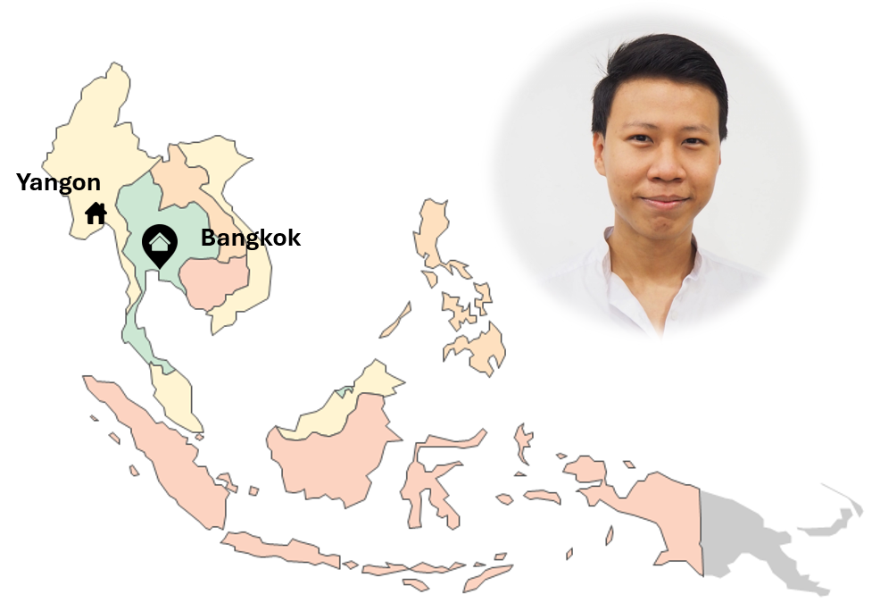
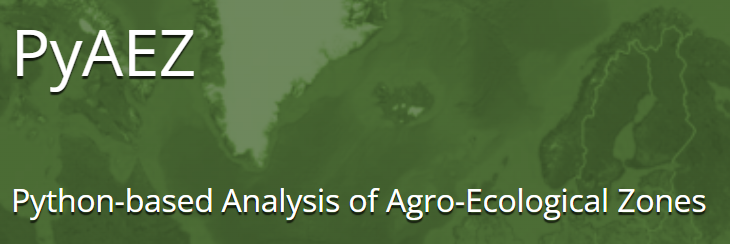
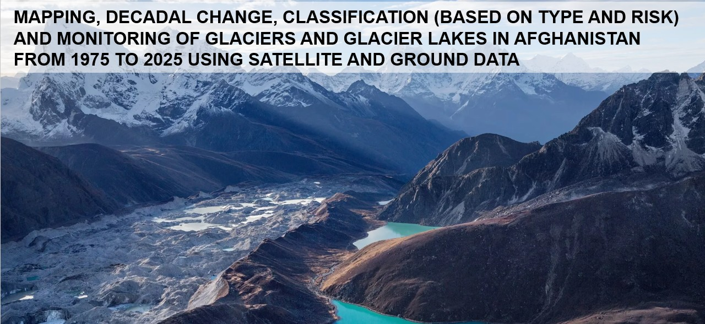

# Introduction

<!-- {align = left} Hi!!! Welcome to my professional channel. From here, you can check out my professional activities, achievements and blogs. I'm a remote sensing expert, and I worked in agricultural, environmental, glaciology fields. Check out my professional email/ linkedin to contact for any work-related stuff. Enjoy!!! -->

<h3>Hi!!! 👋</h3>

  My name's Swun Wunna Htet. Welcome to my professional static website. From here, you can check out my professional activities, achievements and blogs. I'm from Myanmar and currently working in Bangkok, Thailand.

  I come from geology background with focus on geospatial data and remote sensing analysis. I love doing works in snow and glaciology field as my primary interest. My secondary interest was in agricultural section which works with remote sensing for land cover classification.

  Currently, I've been working in
  <a href="https://geoinfo.ait.ac.th/">
    Geoinformatics Center, Asian Institute of Technology (GIC-AIT)
  </a>
  as senior research associate for five years. Currently, I'm seeking Ph.D position in the field of Machine-Learning, AI, EO/remote sensing related to snow/glacier studies. For work-related discussion, please contact my email in
  <a href="./contact/">Contact Me</a>
  section. Enjoy your time!!!

**Main Highlights**

-   

    ### **PyAEZ**

    PyAEZ is a project to develop an open-source python packaging with all the scientific calculation applied for Agro-Ecological Zonation Framework (AEZ) developed by FAO Rome and International Insitute of Applied Systems Analysis (IIASA), Austria.

    [:octicons-arrow-right-24: Read more](./projects/pyaez_1.md)

-   

    ### **Glacier Inventory (FAO Afghanistan)**

    This project highlighted the development of a comprehensive inventory of glaciers and glacial lakes across Afghanistan and provides technical information from decadal change analysis from 1975 to 2025 using satellite data.

    [:octicons-arrow-right-24: Read more](./projects/glacier_1.md)

___

# News Blog

