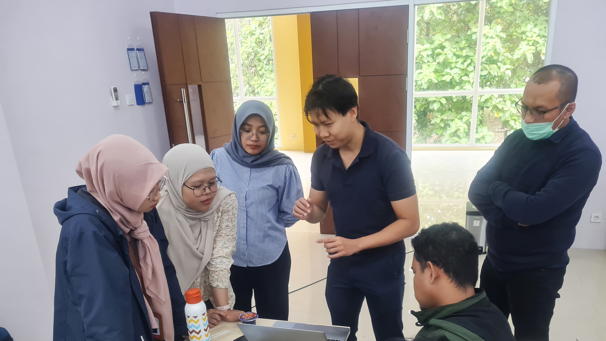
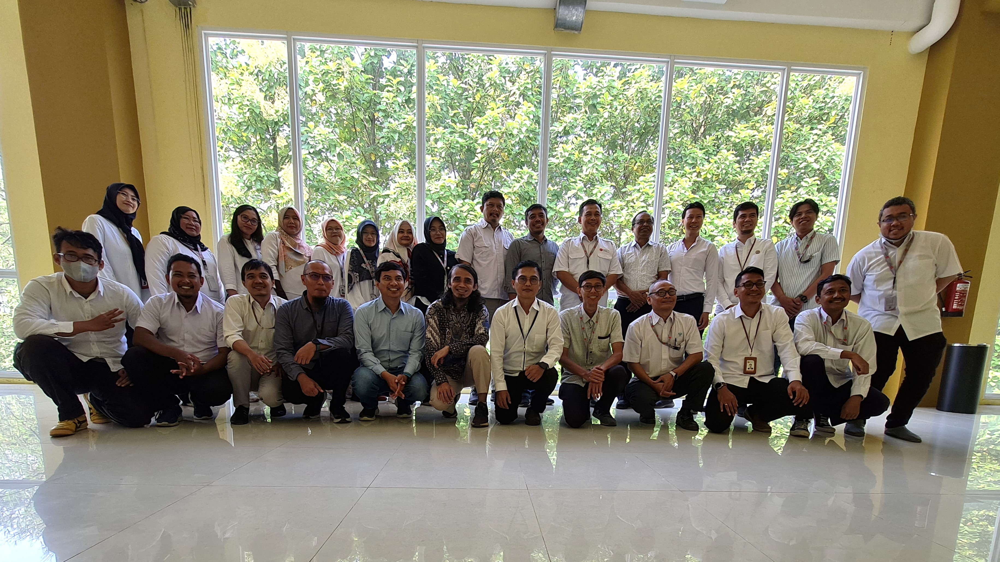

# Capacity Training at BRIN, Indonesia

A six-day capacity training was conducted in BRIN (National Research and Innovation Agency), Indonesia.

<!-- more -->

The training was conducted under the event __"Knowledge Sharing & Capacity Building Workshop - InSAR-based Ground Displacement Monitoring and Cloud-based Earth Observation Services (Cloud SEOS)"__. Under Cloud SEOS theme, Swun briefed the features of Cloud SEOS services and give hand-on training to the participants from government agencies of Indonesia, primarily on the processing of Earth Observation data using the crop processing services and visualization of resultant products from Cloud SEOS platform.

<figure markdown="span">
  { width="500" }
  <figcaption>Swun explaining the functionalities of Cloud SEOS platform</figcaption>

  { width="500" }
  <figcaption>Group photos with all participants</figcaption>
</figure>