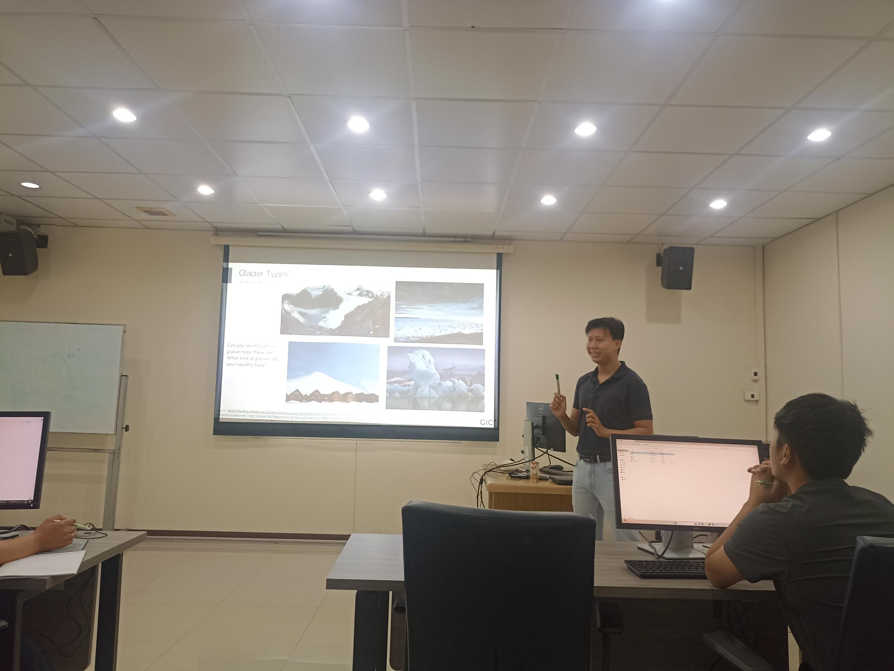
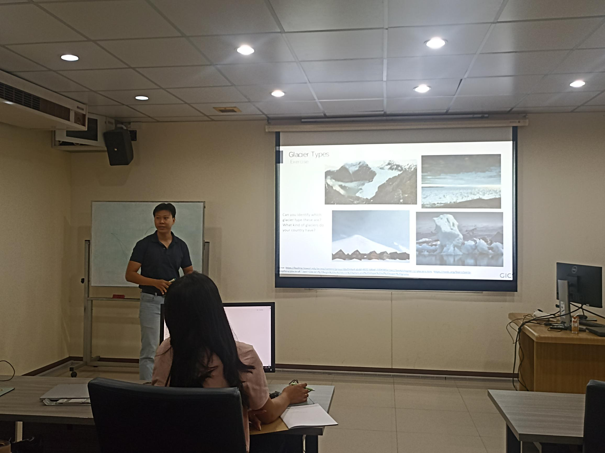
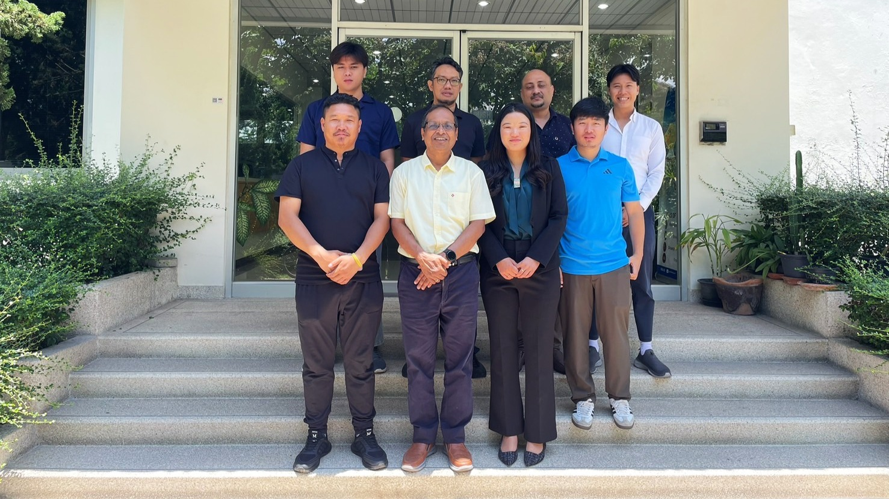

# Training on Drone Image Processing and Analysis for Glacier Monitoring

A two-week training was conducted in Geoinformatics Center (GIC-AIT) from April 28th to May 9th, 2025. 

<!-- more -->

Three national officers from the National Center fro Hydrology and Meteorology (NCHM) of Bhutan attended the training program with the aim of promote better glacier monitoring practices using drong-based technologies. Swun covered theoretical and practical approach of advanced topics of glacier analysis from remote sensing data and softwares. The topics convered were:

1. Glacier dynamics estimation using Google Earth Engine
2. Glacier analytics
3. Glacier mapping using machine learning

<figure markdown="span">
  { width="500" }
  { width="500" }
  { width="500" }
  <figcaption>Group Photo</figcaption>
</figure>
