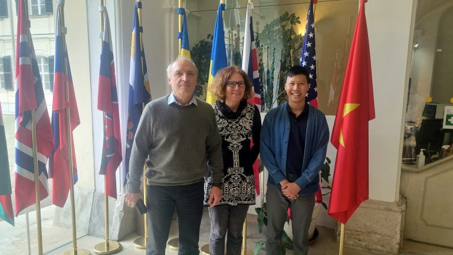

# R&D Visit to IIASA

Swun visited International Institute for Applied Systems Analysis (IIASA), Austria for one month for R&D discussions with PyAEZ algorithm improvement and validation.

<!-- more -->

Dr. Gunther Fischer (Senior Researcher) and Dr. Sylvia Trambrend (Research Scholar) welcomed Swun and discussed the code modification and validation of results from PyAEZ Module II and III, and concepts of development ideas for Module IV, V, VI of GAEZ. Dr. Kerrie Geil (Research Associate Professor), Mississippi State University, USA, also arrived and joinly participated in R&D discussion.

<figure markdown="span">
  { width="500" }
  <figcaption>Group Photo with Dr. Gunther Fischer (Left), Dr. Sylvia Trambrend (Middle)</figcaption>
</figure>

