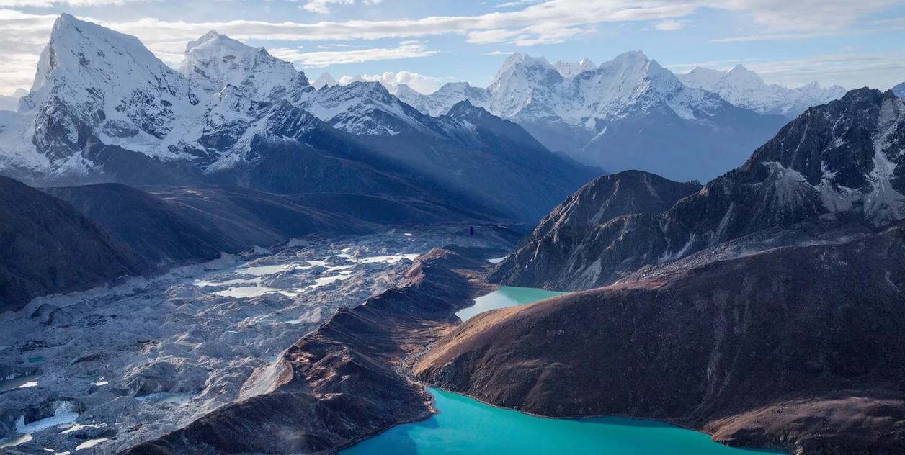

  
  
  

    

      The glacier inventory production for FAO Afghanistan was conducted under the project <i>"Mapping, Decadal Change, Classification (Based on Type and Risk), and Monitoring of Glaciers and Glacier Lakes in Afghanistan (1975-2025) Using Satellite and Ground Data"</i>; the project between GIC-AIT and FAO Afghanistan. Amongst key components, Swun participated in the glacier mapping and glacier inventory establishment from 1975 to 2025 using multi-source satellite data and terrain information.
    

    

    The obtained glacier inventory would be the key information for addressing Afghanistan's national priorities for climate adaptation, water security and disaster management.
    

    

    <strong>Highlighted Works</strong>
    

    <ul>
      <li>Decadal glacier mapping from 1975 to 2025 using semi-automatic machine learning classification approach</li>
      <li>Estimation of glacier area and ice reserve</li>
      <li>Generation of information relevant to glacier change status and statistics based on stakeholders' feedbacks.</li>
      <li>Technical report and glacier inventory submission to FAO-Afghanistan</li>
    </ul>

  

[Check out more about the project](https://geoinfo.ait.ac.th/fao_glacier_2026/){ .md-button }