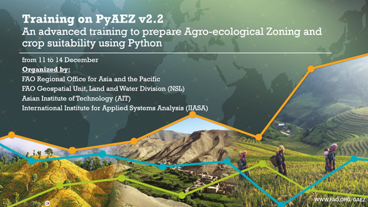
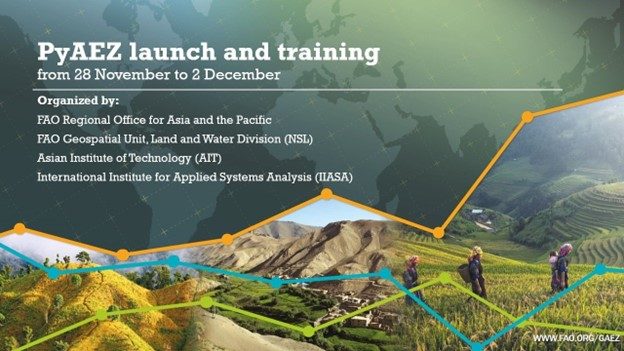

  
  

  

    

      PyAEZ is a project of open-source python package development of FAO Agro-ecological Zonation (AEZ) framework. The package was intended to break the black box nature of AEZ framework and  distribute to researchers/stakeholders/agricultural specialists all around the world. The sophisticated AEZ algorithms and methodology can now be accessed user-friendly simple, fewer codelines and workflows so any non-technical personnels would implement multi-level AEZ projects at their desired project phases. 
    

    

    PyAEZ handles all complex mathematical calculation (e.g., Reference Evapotranspiration by Penmann-Monteith's equation, biomass calculation by De Wit's biophysical model) encapsulated into six major modules. 
    

    

    <strong>My Highlighted Works</strong>
    

    <ul>
      <li>Transfer of GAEZ Fortran routine into open-source python package</li>
      <li>Adding new calculations/validation of generated PyAEZ results with GAEZ outputs</li>
      <li>Resolving technical bugs, maintaining PyAEZ repository, user-engagements</li>
      <li>Training conducts (both in-person & online), tutorial material preparation</li>
      <li>International collaboration</li>
    </ul>

  

-   **Module I: Climate Regime**

    Evaluation of typical agro-climatic information and indicators.

-   **Module II: Crop Simulation**

    Maximum attainable yield estimation with its corresponding thermal, moisture suitability factors, and estimated crop-specific actual evapotranspiration and water deficit.

-   **Module III: Climatic Constraints**

    Evaluation of agro-climatic constraints at a given climatic context.

-   **Module IV: Soil Constraints**

    Soil suitability assessment based on soil properties and the corresponding crop's suitability characteristics based on GAEZ soil evaluation framework.

-   **Module V: Terrain Constraints**

    Terrain suitability assessment based on given terrain slope's conditon with respect to given crop management level.

-   **Module VI: Economic Suitabiltiy**

    Terrain suitability assessment based on given terrain slope's conditon with respect to given crop management level.

___

Additionally, some AEZ major algorithms were also introduced as separate modules that can be applicable separately.

-   **Crop Water Requirement (CropWatCalc)**

    Calculation of crop water requirements based on provided climate, moisture condition and crop stage-specific water demanding factors.

-   **Reference Evapotranspiration Calculation (ETOCalc)**

    Maximum attainable yield estimation with its corresponding thermal, moisture suitability factors, and estimated crop-specific actual evapotranspiration and water deficit.

-   **Biomass Calculation (BioMassCalc)**

    Crop biomass estimation using ecophysical, climatic and crop-specific phenological parameters based on de Wit (1965) publication.

___

**Collaboration between FAO Rome and IIASA**

<figure markdown="span">
  { width="500" }
  <figcaption>Visit to FAO-Rome</figcaption>
</figure>

<figure markdown="span">
  { width="500" }
  <figcaption>Visit to IIASA</figcaption>
</figure>

___

**Conducted Trainings**

-   

    **PyAEZ V2.2 Launch and Training**

    A four-day online training of new PyAEZ v2.2 was conducted with the support from FAO and IIASA.

    [:octicons-arrow-right-24: Read more](https://geoinfo.ait.ac.th/pyaez-online-training-v22/)

-   

    **PyAEZ V2.0 Launch and Training**

    Five-day online training of new PyAEZ v2.0 supported by FAO and IIASA.

    [:octicons-arrow-right-24: Read more](https://geoinfo.ait.ac.th/launch-and-training-of-pyaez-v2-0-0/)

___

**My PyAEZ Publications**

- [Future Hydro-climatic Vulnerability and Its Impact on Water Resources and Economic Crop Suitability in Thailand (2026)](https://link.springer.com/article/10.1007/s44288-026-00599-y)

___

**PyAEZ's Scientific Contribution**

- [An FAO Model Comparison: Python Agroecological Zoning (PyAEZ) and AquaCrop to Assess Climate Change Impacts on Crop Yields in Nepal (2023)](https://www.sciencedirect.com/science/article/pii/S2211464523000829)

- [Effect of Future Climate on Crop Production in Bhutan (2024)](https://riviste.fupress.net/index.php/IJAm/article/view/2782)

- [Maize Yield Suitability Mapping in Two Major Asian Mega Deltas Using AgERA and CIMP6 Climate Projections in Crop Modeling (2025)](https://www.mdpi.com/2073-4395/15/4/878)
___

[Access PyAEZ here](https://github.com/gicait/PyAEZ){ .md-button } [Check out v2.0 User Guide](https://openknowledge.fao.org/items/fdefff8e-ac1e-4118-aa5a-526697ee131e){ .md-button } [PyAEZ Online Trainings](https://gaez.fao.org/pages/community){ .md-button }
___

